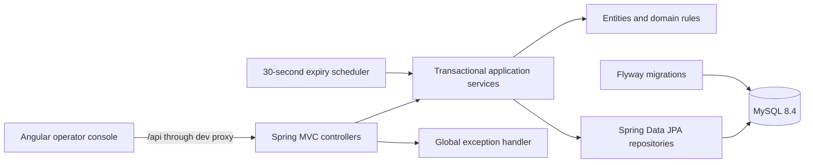
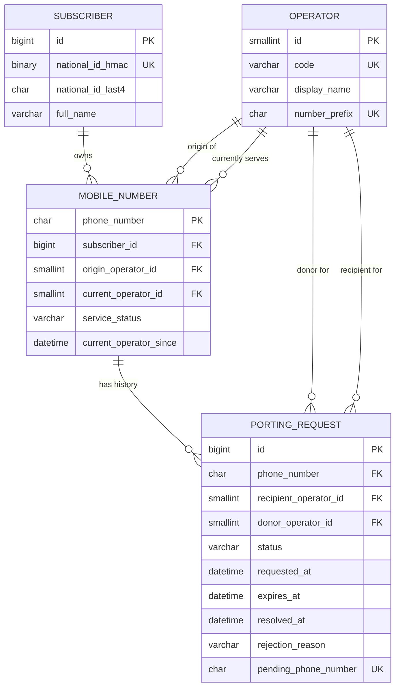
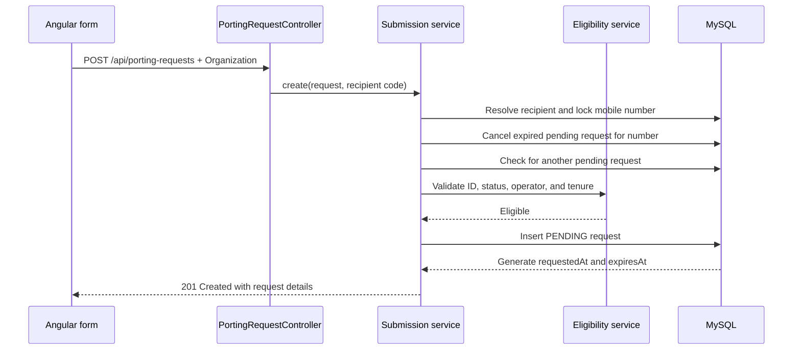
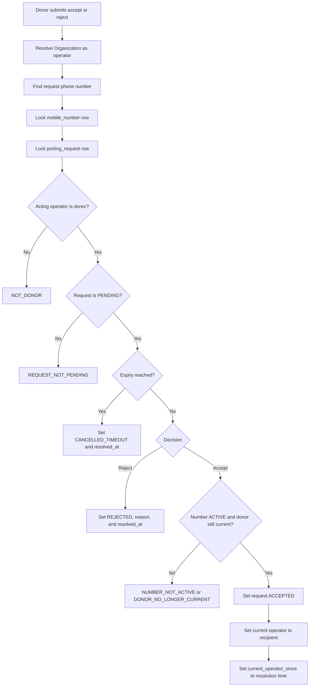
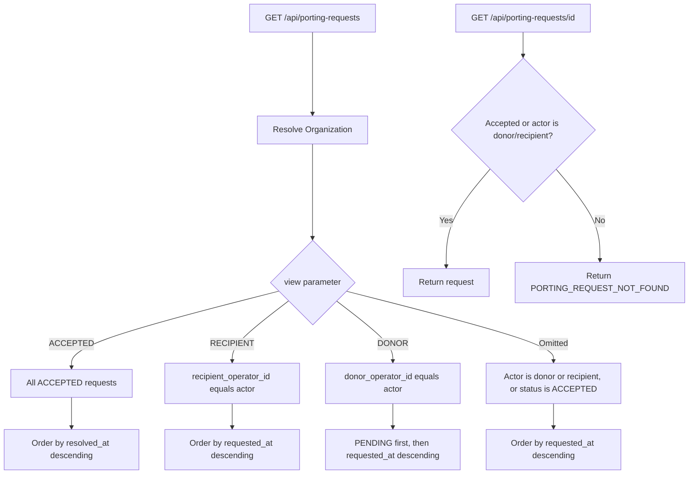
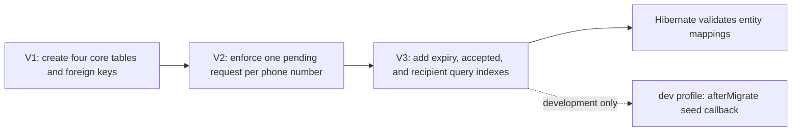

# Mobile Number Portability System

A full-stack operations console for managing mobile-number portability (MNP) requests between telecom operators.

Operator staff can register mobile numbers, submit a request to move a number to another operator, review incoming and outgoing requests, and accept or reject requests for numbers currently owned by their organization. The application also enforces eligibility rules, prevents duplicate pending requests, and automatically expires requests that are not resolved in time.

> This repository is a demonstration system. Organization selection is implemented with an HTTP header and browser storage; it is not user authentication and must not be treated as a production security boundary.

## Assumptions

The system was designed and built under the following assumptions:

- Creating a porting request requires the phone number and the national ID connected to it.
- The number must be in an active service state and must have been served by the donor operator for at least four months.
- The donor operator can reject a porting request and must specify one of the predefined rejection reasons.
- An additional page is provided to create phone numbers with subscribers, allowing operators to register test data for demonstration and validation purposes.

## Table of contents

- [What the application does](#what-the-application-does)
- [Core concepts](#core-concepts)
- [Features](#features)
- [Architecture](#architecture)
- [Database schema and relationships](#database-schema-and-relationships)
- [Feature flows](#feature-flows)
- [Technology stack](#technology-stack)
- [Project structure](#project-structure)
- [Prerequisites](#prerequisites)
- [Configuration](#configuration)
- [Run the application](#run-the-application)
- [Test and build](#test-and-build)
- [Manual test scenarios](#manual-test-scenarios)
- [API summary](#api-summary)
- [Database migrations and data integrity](#database-migrations-and-data-integrity)
- [Troubleshooting](#troubleshooting)
- [Current scope and limitations](#current-scope-and-limitations)

## What the application does

The system models a simplified portability process:

1. A mobile number belongs to a subscriber and has an original and current operator.
2. Staff select the operator organization they are acting for.
3. A recipient operator submits a request to port an eligible number into its network.
4. The number's current operator becomes the donor and can accept or reject the request.
5. Accepting the request changes the number's current operator to the recipient.
6. Unresolved requests expire automatically.

The frontend provides the operator workflow. The backend owns validation, request visibility, state transitions, concurrency control, and persistence.

## Core concepts

| Term               | Meaning in this project                                                                    |
| ------------------ | ------------------------------------------------------------------------------------------ |
| Donor operator     | The number's current operator when a porting request is created.                           |
| Recipient operator | The operator requesting that the number be moved into its network.                         |
| Organization       | The operator code selected in the frontend and sent in the `Organization` request header.  |
| Pending request    | A request awaiting a donor decision. Only one pending request is allowed per phone number. |
| Accepted activity  | Accepted requests are visible across all organizations as network activity.                |

Porting requests use these states:

```text
PENDING ──accept──> ACCEPTED
   │
   ├──reject─────> REJECTED
   │
   └──timeout────> CANCELLED_TIMEOUT
```

Supported rejection reasons are `IDENTITY_MISMATCH`, `OUTSTANDING_BALANCE`, `ACCOUNT_RESTRICTION`, and `FRAUD_SUSPECTED`.

## Features

### Operator session

- Validates an operator code against the backend before opening the console.
- Stores the selected code in browser `localStorage` under `mnp.organizationCode`.
- Adds the code to API requests through the `Organization` header.
- Guards application routes until an organization has been selected.
- Allows staff to clear the session and switch organizations.

This is contextual organization selection, not authentication.

### Mobile-number registration

- Loads the available operators from the backend.
- Registers an 11-digit Egyptian mobile number, its subscriber, service status, operator, and current-operator start date.
- Validates the phone format, 14-digit national ID, subscriber name, operator prefix, and future dates in both the UI and backend.
- Reuses an existing subscriber when the national ID HMAC already exists.
- Stores only a SHA-256 HMAC of the national ID and its final four digits; the raw national ID is not persisted.
- Can carry a newly registered number and national ID directly into the new-request form through an in-memory draft.

Supported service states are `ACTIVE`, `SUSPENDED`, and `DISCONNECTED`.

### Porting-request submission

- Creates a request for the selected organization as recipient.
- Verifies that the number exists and belongs to a different current operator.
- Verifies the submitted national ID against the stored HMAC.
- Requires the number to be active.
- Requires at least four months with the current operator.
- Cancels an expired pending request for the number before checking for a duplicate.
- Prevents more than one pending request for the same phone number at both service and database levels.

### Request work queues

The request list has three server-side, paginated views:

- **Accepted** — accepted activity across all operators, ordered by resolution time.
- **Outgoing** — requests where the selected organization is the recipient.
- **Incoming** — requests where the selected organization is the donor; pending items are prioritized.

The UI keeps the selected view, page, and page size in query parameters. Supported page sizes are 10, 20, and 50.

### Request details and decisions

- Shows the donor, recipient, status, request time, expiry time, resolution time, and rejection reason.
- Displays decision actions only when the selected organization is the donor and the request is still pending.
- Requires confirmation before acceptance.
- Requires one of the defined rejection reasons before rejection.
- Rechecks donor ownership, request state, expiry, and number status inside a transaction.
- Updates the number's current operator and tenure timestamp when a request is accepted.

### Automatic expiry and operational feedback

- New requests receive a database-generated expiry time two minutes after creation.
- A scheduled backend job cancels expired pending requests with a fixed 30-second delay between runs.
- Decision attempts also detect and cancel an already-expired request immediately.
- API errors use a consistent `{ "error", "message" }` response shape.
- The frontend maps domain error codes to actionable messages and handles unavailable-service errors separately.
- Spring Boot Actuator exposes `/actuator/health` and `/actuator/info`.

## Architecture



The Angular development server proxies `/api` to `http://localhost:8080`. Docker Compose runs MySQL and the backend; the frontend is run separately with the Angular development server.

## Database schema and relationships



### Relationship semantics

- One subscriber can own multiple mobile numbers. `subscriber.national_id_hmac` uniquely identifies the subscriber without storing the raw national ID.
- Every mobile number has one immutable origin operator and one current operator. Both relationships reference `operator.id`.
- Accepting a request updates `mobile_number.current_operator_id` and `current_operator_since`; it does not change `origin_operator_id`.
- A mobile number can accumulate many historical porting requests.
- Every porting request records one donor and one recipient. The donor is the number's current operator at submission time; the recipient is the organization submitting the request.
- `pending_phone_number` is a stored generated column. It contains the phone number only while a request is `PENDING`, otherwise it is `NULL`. Its unique constraint permits request history while preventing two pending rows for the same number.

### Table responsibilities

| Table             | Primary key    | Important constraints                                                             | Role                                                                           |
| ----------------- | -------------- | --------------------------------------------------------------------------------- | ------------------------------------------------------------------------------ |
| `operator`        | `id`           | Unique `code` and `number_prefix`                                                 | Telecom organizations and their three-digit number prefixes.                   |
| `subscriber`      | `id`           | Unique 32-byte `national_id_hmac`                                                 | Subscriber identity data without raw national-ID storage.                      |
| `mobile_number`   | `phone_number` | Foreign keys to subscriber, origin operator, and current operator                 | Current ownership, service status, and operator tenure for an 11-digit number. |
| `porting_request` | `id`           | Foreign keys to the number, donor, and recipient; unique generated pending number | Request history, state, timing, and rejection outcome.                         |

## Feature flows

### 1. Select an organization

1. The organization page submits a candidate operator code using `GET /api/porting-requests` with the candidate `Organization` header.
2. `OperatorResolver` normalizes the code and verifies it exists.
3. On success, the frontend stores the normalized code and navigates to the request list.
4. The HTTP interceptor adds the active organization to later API calls unless a request already supplies the header explicitly.

### 2. Register a mobile number

1. The frontend loads operator codes and number prefixes from `GET /api/operators`.
2. The user submits subscriber, number, service-status, tenure-date, and operator data to `POST /api/mobile-numbers`.
3. `MobileNumberService` resolves the operator, validates its prefix and the date, and calculates the national ID HMAC.
4. The service reuses the matching subscriber or creates a new subscriber with the HMAC, last four ID digits, and normalized name.
5. The new number is saved with the same origin and current operator.
6. The user can start a porting request immediately; the frontend transfers the phone number and national ID through a one-use in-memory draft.

### 3. Submit a porting request



The mobile-number row is locked during submission. A generated `pending_phone_number` column with a unique constraint provides a second line of defense against concurrent duplicate submissions.

### 4. Accept or reject a request

1. The backend resolves the acting donor from the `Organization` header.
2. It finds the request's phone number, locks the mobile-number row, and then locks the request row.
3. It verifies that the acting operator is the recorded donor and the request is pending.
4. If the request is already due, it transitions to `CANCELLED_TIMEOUT` and returns that state.
5. For acceptance, it also verifies that the number remains active and the recorded donor is still its current operator.
6. Acceptance changes the request to `ACCEPTED` and ports the number to the recipient in the same transaction.
7. Rejection changes the request to `REJECTED` and records the selected reason without changing the number's operator.



The service locks the mobile-number row before the request row for both acceptance and rejection. The state change and any ownership update commit together.

### 5. List and open requests

1. The frontend translates the Accepted, Outgoing, or Incoming tab into `ACCEPTED`, `RECIPIENT`, or `DONOR`.
2. The backend resolves the acting operator and runs the corresponding paginated repository query.
3. A detail request is returned only when it is accepted globally or the acting organization is its donor or recipient.
4. A non-visible request is deliberately reported as `PORTING_REQUEST_NOT_FOUND`.



## Technology stack

| Layer                        | Technologies                                                                    |
| ---------------------------- | ------------------------------------------------------------------------------- |
| Frontend                     | Angular 22.1, Angular Material/CDK 22.1, RxJS 7.8, TypeScript 6.0, SCSS         |
| Frontend testing             | Angular unit-test builder, Vitest 4, jsdom                                      |
| Backend                      | Java 25, Spring Boot 4.1.1, Spring Web MVC, Spring Data JPA, Jakarta Validation |
| Persistence                  | MySQL 8.4.11, Hibernate through Spring Data JPA, Flyway migrations              |
| Supporting backend libraries | Lombok, MySQL Connector/J, Spring Boot Actuator                                 |
| Build and runtime            | Maven Wrapper 3.9.16, npm 11.19.0, Docker Compose, multi-stage Docker image     |

## Project structure

```text
MobileNumberPortabilitySystem/
├── backend/mnp/
│   ├── Dockerfile
│   ├── pom.xml
│   ├── mvnw / mvnw.cmd
│   └── src/
│       ├── main/
│       │   ├── java/com/fourgtss/mnp/
│       │   │   ├── config/       # UTC clock configuration
│       │   │   ├── controller/   # REST endpoints
│       │   │   ├── dto/          # Request and response contracts
│       │   │   ├── exception/    # Domain errors and HTTP mapping
│       │   │   ├── mapper/       # Entity-to-response mapping
│       │   │   ├── models/       # JPA entities and enums
│       │   │   ├── repository/   # Spring Data queries and locks
│       │   │   ├── service/      # Use cases, validation, decisions, expiry
│       │   │   └── MnpApplication.java
│       │   └── resources/
│       │       ├── application.yaml
│       │       ├── application-dev.yaml
│       │       └── db/
│       │           ├── migration/ # Versioned production schema migrations
│       │           └── dev/       # Fictional development seed callback
│       └── test/                   # Spring context test
├── frontend/
│   ├── angular.json
│   ├── package.json
│   ├── package-lock.json
│   ├── proxy.conf.json
│   └── src/app/
│       ├── core/
│       │   ├── guards/            # Organization route guard
│       │   ├── http/              # Organization header interceptor
│       │   ├── models/            # API-facing TypeScript types
│       │   ├── services/          # API, draft, and error-message services
│       │   └── session/           # Browser organization state
│       ├── features/
│       │   ├── numbers/           # Mobile-number registration
│       │   ├── organization/      # Organization selection
│       │   └── requests/          # Lists, details, creation, decisions
│       ├── layout/                # Authenticated application shell
│       └── shared/                # Shared status badge
├── .env.example
├── compose.yml
└── README.md
```

## Prerequisites

For the recommended setup:

- Docker Desktop or another Docker installation with the Compose plugin.
- Node.js compatible with the Angular version declared in `frontend/package.json`.
- npm; the project records npm `11.19.0` as its package manager.

For running the backend directly or executing backend tests outside Docker:

- JDK 25. Maven does not need to be installed globally because the Maven Wrapper is included.
- A reachable MySQL 8.4 database.

## Configuration

Create the local environment file from the provided template:

```bash
cp .env.example .env
```

PowerShell equivalent:

```powershell
Copy-Item .env.example .env
```

Change the placeholder passwords before starting the stack. The sample HMAC key is for local development only.

| Variable                   | Purpose                                                                            | Template/default behavior                             |
| -------------------------- | ---------------------------------------------------------------------------------- | ----------------------------------------------------- |
| `MNP_DB_NAME`              | MySQL database created by Compose.                                                 | `mnp`                                                 |
| `MNP_DB_USERNAME`          | Application database user.                                                         | `mnp` in Compose                                      |
| `MNP_DB_PASSWORD`          | Application database password.                                                     | Required by Compose                                   |
| `MYSQL_ROOT_PASSWORD`      | MySQL root password.                                                               | Required by Compose                                   |
| `MNP_MYSQL_PORT`           | Host port mapped to MySQL port 3306.                                               | `3306`                                                |
| `MNP_SERVER_PORT`          | Host port mapped to backend port 8080.                                             | `8080`                                                |
| `MNP_NATIONAL_ID_HMAC_KEY` | Base64-encoded HMAC key for national IDs. It must decode to at least 32 bytes.     | Required by Compose                                   |
| `SPRING_PROFILES_ACTIVE`   | Spring profile used by the backend container.                                      | `dev`                                                 |
| `MNP_LOG_LEVEL`            | Log level for `com.fourgtss.mnp`.                                                  | `INFO`                                                |
| `MNP_DB_URL`               | JDBC URL used when the backend runs directly. Compose constructs it automatically. | Local backend fallback points to `localhost:3306/mnp` |

The frontend proxy targets backend port `8080`. If `MNP_SERVER_PORT` is changed, update `frontend/proxy.conf.json` to match.

The `dev` profile adds `db/dev` to Flyway's locations. It loads fictional operators, subscribers, numbers, and historical requests. Do not enable this profile for a production deployment.

## Run the application

### Recommended: backend and database in Docker

From the repository root:

```bash
docker compose up --build -d
```

Check that both services are running:

```bash
docker compose ps
docker compose logs -f backend
```

The backend is available at `http://localhost:8080` when the template port is used. Verify it with:

```bash
curl http://localhost:8080/actuator/health
```

Start the frontend in a second terminal:

```bash
cd frontend
npm ci
npm start
```

Open `http://localhost:4200`. With the default `dev` profile, use one of these fictional organization codes:

- `VODAFONE`
- `ETISALAT`
- `ORANGE`

Stop the backend and database containers with:

```bash
docker compose down
```

This preserves the named MySQL volume. To completely reset development data, use `docker compose down -v`; this permanently deletes the project's local database volume.

### Run the backend directly

Start only MySQL:

```bash
docker compose up -d --wait mysql
```

Export `MNP_DB_URL`, `MNP_DB_USERNAME`, `MNP_DB_PASSWORD`, and `MNP_NATIONAL_ID_HMAC_KEY` so that they match `.env`, then run:

```bash
cd backend/mnp
./mvnw spring-boot:run -Dspring-boot.run.profiles=dev
```

On Windows, use `mvnw.cmd`:

```powershell
cd backend/mnp
.\mvnw.cmd spring-boot:run "-Dspring-boot.run.profiles=dev"
```

## Test and build

### Frontend unit tests

```bash
cd frontend
npm ci
npm test -- --watch=false
```

The current suite covers application creation, organization-header interception, and the porting-request API client's paging and validation requests. For interactive watch mode, run `npm test` without `--watch=false`.

### Frontend production build

```bash
cd frontend
npm ci
npm run build
```

Build output is written to `frontend/dist/frontend`.

### Backend tests

The current Spring test loads the full application context, so MySQL must be available and the backend environment variables must be set. Start the database first:

```bash
docker compose up -d --wait mysql
```

On Bash-compatible shells, load `.env` and run the Maven Wrapper from the repository root:

```bash
set -a
. ./.env
set +a

cd backend/mnp
MNP_DB_URL="jdbc:mysql://localhost:${MNP_MYSQL_PORT:-3306}/${MNP_DB_NAME:-mnp}?connectionTimeZone=UTC&forceConnectionTimeZoneToSession=true" \
MNP_DB_USERNAME="${MNP_DB_USERNAME:-mnp}" \
MNP_DB_PASSWORD="$MNP_DB_PASSWORD" \
MNP_NATIONAL_ID_HMAC_KEY="$MNP_NATIONAL_ID_HMAC_KEY" \
./mvnw test
```

PowerShell equivalent, run from the repository root:

```powershell
$config = @{}
Get-Content .env | ForEach-Object {
    $line = $_.Trim()
    if ($line -and -not $line.StartsWith('#')) {
        $parts = $line.Split('=', 2)
        if ($parts.Count -eq 2) { $config[$parts[0]] = $parts[1] }
    }
}

$env:MNP_DB_URL = "jdbc:mysql://localhost:$($config['MNP_MYSQL_PORT'])/$($config['MNP_DB_NAME'])?connectionTimeZone=UTC&forceConnectionTimeZoneToSession=true"
$env:MNP_DB_USERNAME = $config['MNP_DB_USERNAME']
$env:MNP_DB_PASSWORD = $config['MNP_DB_PASSWORD']
$env:MNP_NATIONAL_ID_HMAC_KEY = $config['MNP_NATIONAL_ID_HMAC_KEY']

Push-Location backend/mnp
.\mvnw.cmd test
Pop-Location
```

### Full verification checklist

```bash
docker compose config --quiet
docker compose up -d --wait mysql
```

Then run the backend test, frontend tests, and frontend build using the commands above. End with `docker compose down` if the services are no longer needed.

## Manual test scenarios

The following data is loaded only by the `dev` profile.

### Happy-path request and decision

1. Start the full application and select `ORANGE` as the organization.
2. Open **New request**.
3. Submit phone number `01010000001` with national ID `29801011234567`.
4. Confirm that the new request appears under **Outgoing** with status `PENDING`.
5. Change the organization to `VODAFONE`, the number's donor operator.
6. Open **Incoming**, select the request, and accept or reject it.
7. For acceptance, confirm that the request becomes `ACCEPTED` and appears in the network-wide **Accepted** view.
8. For rejection, select one of the required rejection reasons and confirm that it is shown on the detail page.

The request expires two minutes after creation. If testing a donor decision, complete it before that deadline.

### Automatic expiry

1. Submit the same eligible fixture as a new request when it has no other pending request.
2. Leave the request unresolved for at least two minutes.
3. Allow up to another 30 seconds for the scheduler, then refresh the detail or list page.
4. Confirm that its status is `CANCELLED_TIMEOUT`.

### Eligibility and validation errors

- Select `VODAFONE` and submit `01010000001` to trigger `SAME_OPERATOR`.
- Submit an incorrect 14-digit national ID for a known number to trigger `NATIONAL_ID_MISMATCH`.
- Use fixture `01010000002` with national ID `30104041234560` from a different recipient organization to trigger `NUMBER_NOT_ACTIVE` because the number is suspended.
- Submit the same eligible number twice while its first request is pending to trigger `PENDING_REQUEST_EXISTS`.
- Try to decide a request while acting as an operator other than its donor to trigger `NOT_DONOR`.

Manual tests change persistent development data. Use `docker compose down -v` and restart the stack when a clean fixture state is required.

## API summary

All porting-request endpoints require the `Organization` header. The operator and mobile-number endpoints do not require it.

| Method | Path                                | Purpose                                             |
| ------ | ----------------------------------- | --------------------------------------------------- |
| `GET`  | `/api/operators`                    | List configured operators.                          |
| `POST` | `/api/mobile-numbers`               | Register a subscriber and mobile number.            |
| `POST` | `/api/porting-requests`             | Submit a porting request for the acting recipient.  |
| `GET`  | `/api/porting-requests`             | List requests; accepts `view`, `page`, and `size`.  |
| `GET`  | `/api/porting-requests/{id}`        | Read a visible request.                             |
| `POST` | `/api/porting-requests/{id}/accept` | Accept a pending request as its donor.              |
| `POST` | `/api/porting-requests/{id}/reject` | Reject a pending request with a reason.             |
| `GET`  | `/actuator/health`                  | Read application health without detailed internals. |
| `GET`  | `/actuator/info`                    | Read application information.                       |

Example submission:

```bash
curl -X POST http://localhost:8080/api/porting-requests \
  -H "Content-Type: application/json" \
  -H "Organization: ORANGE" \
  -d '{"phoneNumber":"01010000001","nationalId":"29801011234567"}'
```

Validation and domain failures use this shape:

```json
{
  "error": "PENDING_REQUEST_EXISTS",
  "message": "Pending request exists"
}
```

The backend returns `400` for malformed or invalid input, `403` for national-ID or donor-authorization failures, `404` for unavailable resources, `409` for state and data conflicts, and `500` for unexpected failures.

## Database migrations and data integrity

Flyway owns the schema. Hibernate is configured with `ddl-auto: validate`, so Hibernate checks the mappings while Flyway applies schema changes.



Migration responsibilities:

- `V1__init_schema.sql` creates `operator`, `subscriber`, `mobile_number`, and `porting_request`, including the base foreign keys and `idx_pr_phone_status`.
- `V2__enforce_single_pending_request.sql` adds `pending_phone_number` and the `uk_pr_one_pending_per_phone` unique constraint.
- `V3__add_query_indexes.sql` adds `idx_pr_status_expires_at`, `idx_pr_status_resolved_at`, and `idx_pr_recipient_requested_at`.
- Under the `dev` profile, `afterMigrate__seed_test_data.sql` uses `NOT EXISTS` checks while inserting fictional operators, subscribers, mobile numbers, and historical requests.

The principal tables are:

- `operator` — operator code, display name, and unique three-digit prefix.
- `subscriber` — normalized name, national ID HMAC, and final four ID digits.
- `mobile_number` — subscriber, original operator, current operator, service status, and current-operator tenure start.
- `porting_request` — donor, recipient, status, timestamps, and optional rejection reason.

The migrations also add:

- A generated column and unique constraint that allow only one `PENDING` request per number.
- Indexes for expiry scans, accepted-activity ordering, and recipient request queries.

Submission and decision services use transactions and pessimistic row locks to keep request and number transitions consistent during concurrent operations. All application timestamps and database sessions are configured for UTC.

## Troubleshooting

### The organization is rejected

Confirm that the backend was started with the `dev` profile if you expect the fictional operators. Check `SPRING_PROFILES_ACTIVE=dev` in `.env`, then inspect `docker compose logs backend`.

### The frontend cannot reach the API

Confirm that the backend is healthy on port 8080 and that `frontend/proxy.conf.json` points to the same port. If `MNP_SERVER_PORT` was customized, update the proxy target or restore port 8080.

### MySQL cannot bind its host port

Set `MNP_MYSQL_PORT` in `.env` to a free host port. The container still listens on 3306; only the host mapping changes.

### Backend tests cannot connect to MySQL

Run `docker compose up -d --wait mysql`, then verify that the test's `MNP_DB_URL` uses `MNP_MYSQL_PORT` from `.env`, not an assumed port.

### The backend refuses the HMAC key

`MNP_NATIONAL_ID_HMAC_KEY` must be valid Base64 and decode to at least 32 bytes. Keep the key stable for an existing database; changing it prevents new national-ID checks from matching previously stored HMAC values.

### Flyway validation fails

Do not edit an applied migration. Add a new versioned file under `backend/mnp/src/main/resources/db/migration`. For disposable local data, reset the Compose volume and restart, understanding that `docker compose down -v` deletes all local database contents.

## Current scope and limitations

- Organization context is client-selected and header-based; there is no account login, identity provider, role model, or cryptographic request authentication.
- The Compose stack contains MySQL and the backend only. The frontend currently runs with the Angular development server.
- The backend test suite currently verifies application-context startup against MySQL; it does not yet cover domain rules or REST flows comprehensively.
- The frontend has unit coverage for the application root, organization interceptor, and request API service, but no configured end-to-end test runner.
- The two-minute request lifetime is defined by the database schema and is suited to demonstration workflows rather than a configurable production SLA.
- The `dev` profile contains fictional seed data and must remain isolated from production environments.

Good next additions would be authenticated operator identities, authorization policies, Testcontainers-based backend integration tests, frontend end-to-end coverage, configurable expiry policy, production deployment configuration, CI automation, and an explicit repository license.
